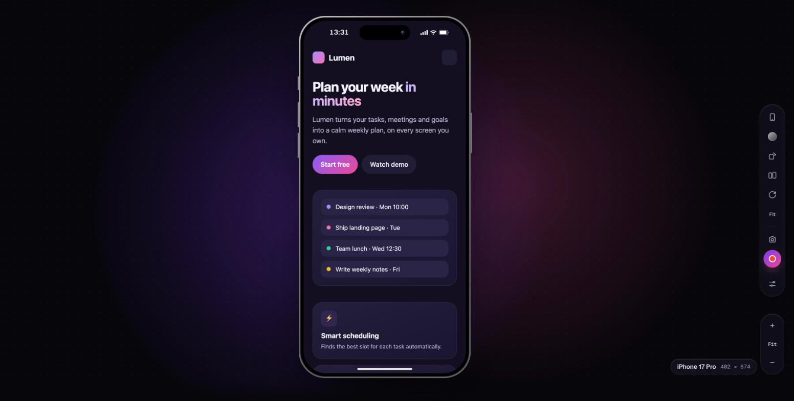
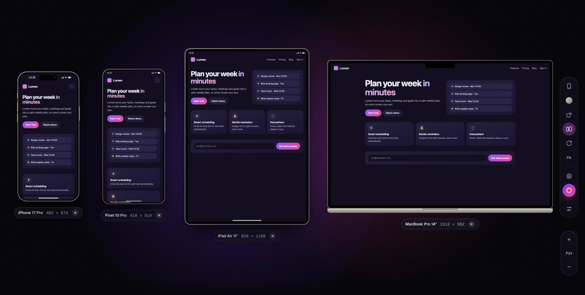
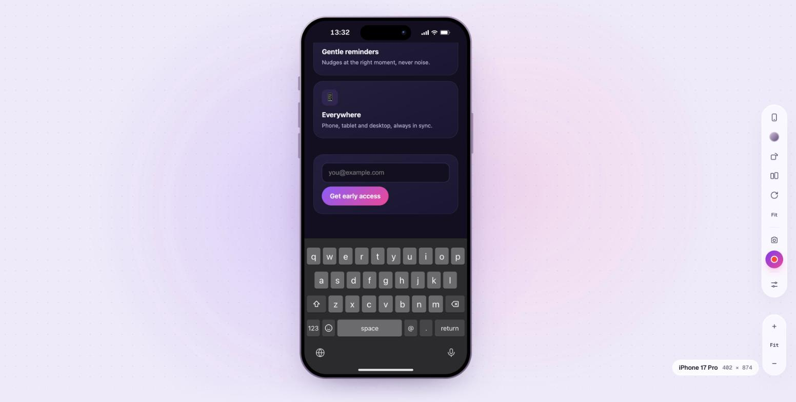

# Mobile Simulator

A free Chrome extension to preview any website in realistic phone, tablet and desktop frames: test responsive layouts, take beautiful screenshots and record videos. No account, no tracking, nothing locked behind a paywall.

| Compare devices | Phone keyboard |
|---|---|
|  |  |

Screenshots use a demo website.

## Features

- **Side panel**: the website stays in your tab, the phone preview sits next to it and follows the tab you're on.
- **Scroll sync**: scroll the website, the phone follows (and the other way round). By percentage or by section.
- **Full screen**: an immersive simulator over the page, with a toolbar you can place on any side.
- **Devices**: recent iPhones, Android phones, iPads and Android tablets, MacBook / Windows laptop / desktop monitor, plus your own custom sizes.
- **Realistic frames**: Dynamic Island (with animations), notch, punch-hole, home button, side buttons, status bar that takes the site's colour, 20+ frame finishes or your own gradient.
- **Compare**: 2 to 5 devices side by side; a page opened in one opens in all.
- **Phone keyboard**: tap a field and an iOS, Gboard or iPad keyboard slides up, adapting to the field type (email, number, URL, search…). The page shrinks above it like on a real phone.
- **Screenshots**: export as PNG, JPEG or WebP with gradient backgrounds, padding, shadow, sizes for social media (1:1, 9:16, 4:5, 16:9) and a caption.
- **Video recording**: MP4 with a 3-second countdown, microphone, three quality levels and a review screen before saving. No sharing prompt when started from the extension.
- **Zoom & rotation**: smooth zoom (map-style + / Fit / −) and rotation.
- **Mobile identity**: sites receive a real phone browser identity, so they serve their mobile version.

## Install

The extension isn't on the Chrome Web Store yet. Install it in developer mode (it takes a minute):

1. **Download the code**
   - Click the green **Code** button on this page → **Download ZIP**, then unzip it, **or**
   - clone it: `git clone https://github.com/jhmesseroux/mobile-simulator-extension.git`
2. Open Chrome and go to **`chrome://extensions`**.
3. Turn on **Developer mode** (switch in the top-right corner).
4. Click **Load unpacked** and select the `mobile-simulator-extension` folder (the one containing `manifest.json`).
5. Click the puzzle icon in Chrome's toolbar and **pin** Mobile Simulator so its icon is always visible.

Works in Chrome and other Chromium browsers (Brave, Edge, Arc) recent enough to support the side panel (Chrome 116+).

### Update

- If you downloaded the ZIP: download it again and replace the folder.
- If you cloned it: run `git pull` in the folder.

Then open `chrome://extensions` and click the **reload** arrow on Mobile Simulator.

## Use

| To… | Do this |
|---|---|
| Open the side panel | Click the extension icon, or press **Alt+Shift+M** |
| Open full screen on the page | Right-click the icon → **Open full screen**, press **Alt+Shift+F**, or use the full-screen button in the side panel |
| Simulate a link in a new tab | Right-click a link → **Open link in Mobile Simulator** |
| Leave full screen | **×** in the top-right corner, or **Esc** |
| Move the side panel left / right | The left/right button in the panel opens Chrome's setting (it's Chrome-wide) |

### Shortcuts (in the simulator)

| Key | Action |
|---|---|
| `D` | Devices |
| `R` | Rotate |
| `C` | Compare devices |
| `S` | Screenshot |
| `V` | Record / stop |
| `+` `−` `0` | Zoom in / out / fit |
| `⌘R` / `F5` | Reload the page in the phone only |
| `Esc` | Close menus, dialogs, full screen |

Shortcuts for opening the extension can be changed in `chrome://extensions/shortcuts`.

## Permissions

| Permission | Why |
|---|---|
| Read and change data on websites | Let sites load inside the phone frame and receive a mobile identity, only in the simulator's own tab or panel |
| Side panel | Show the simulator next to the website |
| Tab capture | Record videos of the simulator without a sharing prompt |
| Scripting | Show the full-screen simulator over the page |
| Tabs, web navigation | Follow the active tab, restore full screen after a page refresh |
| Storage | Remember your settings |
| Context menus | Right-click entries |
| Clipboard write | "Copy" in the screenshot dialog |
| Favicon | Show site icons in the Dynamic Island |

## Privacy

Everything runs in your browser. The extension has no server, no account and no analytics; screenshots and videos are saved only where you choose.

## Known limits

- Some sites refuse to run inside another page (e.g. some sign-in or banking pages).
- Being logged in on a site in your normal tab doesn't always carry over inside the simulator.
- It shows the layout at real device sizes, not every browser-engine difference (e.g. Safari-only bugs).
- After a page refresh in full screen, Chrome may ask once before recording; use the icon menu or Alt+Shift+F again to avoid it.

## Project structure

- `manifest.json`: extension configuration
- `background.js`: icon, side panel, right-click menu, full screen over a page, rule cleanup
- `simulator.html` / `simulator.css` / `simulator.js`: the simulator (side panel, full screen and new tab)
- `frame.js`: runs inside previewed pages (touch scrolling, keyboard, scroll sync)
- `lib/`: devices and frames, header rules, screenshot/video look, recorder, keyboards
- `vendor/mp4-muxer.mjs`: [mp4-muxer](https://github.com/Vanilagy/mp4-muxer) (MIT)
- `SPEC.md`: detailed feature specification and history

Plain JavaScript, no build step: edit the files and reload the extension.
